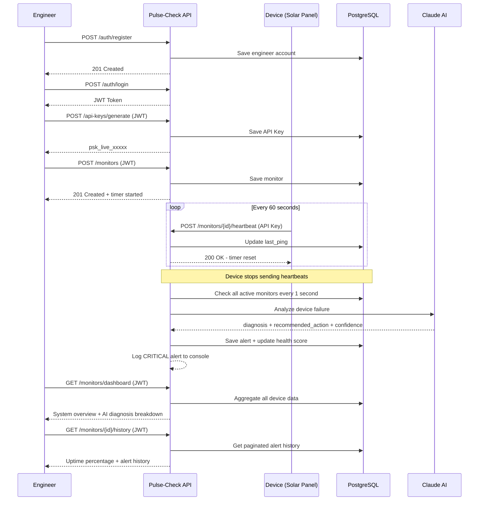

# Pulse-Check API

A production-grade Dead Man's Switch API built for CritMon Servers Inc.
The system monitors remote IoT devices such as solar farms and weather stations.
Devices register with a countdown timer and must send periodic heartbeats to
confirm they are online. If a device fails to ping before its timer expires,
the system automatically triggers an AI-powered alert with diagnosis and
recommended action.

---

## Table of Contents

- [Architecture Diagram](#architecture-diagram)
- [Tech Stack](#tech-stack)
- [Project Structure](#project-structure)
- [Setup Instructions](#setup-instructions)
- [API Documentation](#api-documentation)
- [Security Model](#security-model)
- [Developer's Choice Features](#developers-choice-features)
- [Design Decisions](#design-decisions)

---

## Architecture Diagram



### Visual Diagram

> Screenshot diagram.html in your browser and save as diagram.png
> to display the image below.


---

## Tech Stack

| Technology | Purpose |
|---|---|
| FastAPI | Web framework |
| PostgreSQL | Production database |
| SQLAlchemy | Async ORM |
| Alembic | Database migrations |
| APScheduler | Background timer jobs |
| Anthropic Claude API | AI-powered failure analysis |
| Docker | PostgreSQL containerization |
| python-jose | JWT token generation |
| passlib + bcrypt | Password hashing |
| slowapi | Rate limiting |
| Pydantic | Input validation |
| Uvicorn | ASGI server |

---

## Project Structure

```
Pulse-Check/
├── app/
│   ├── main.py              # Application entry point and middleware
│   ├── database.py          # Database connection and session management
│   ├── models.py            # SQLAlchemy database models
│   ├── schemas.py           # Pydantic request/response schemas
│   ├── security.py          # Authentication logic (API Key + JWT)
│   ├── routers/
│   │   ├── monitors.py      # Device monitoring endpoints
│   │   ├── api_keys.py      # API key management endpoints
│   │   └── auth.py          # Engineer authentication endpoints
│   └── services/
│       ├── scheduler.py     # APScheduler timer management
│       ├── ai_analyzer.py   # Claude AI integration
│       └── jwt_handler.py   # JWT token utilities
├── alembic/                 # Database migration files
├── docker-compose.yml       # PostgreSQL container configuration
├── requirements.txt         # Python dependencies
├── .env.example             # Environment variable template
└── README.md                # This file
```

---

## Setup Instructions

### Prerequisites

- Python 3.10 or higher
- Docker Desktop
- Git

### Step 1 - Clone the repository

```bash
git clone https://github.com/mizero-adrien/AmaliTech-DEG-pulse-check-api.git
cd AmaliTech-DEG-pulse-check-api/backend/Pulse-Check
```

### Step 2 - Create virtual environment

```bash
python -m venv venv
venv\Scripts\activate        # Windows
source venv/bin/activate     # Mac/Linux
```

### Step 3 - Install dependencies

```bash
pip install -r requirements.txt
```

### Step 4 - Configure environment variables

```bash
cp .env.example .env
```

Open `.env` and fill in your values:
- `DATABASE_URL`: PostgreSQL connection string
- `ANTHROPIC_API_KEY`: Get from https://console.anthropic.com
- `SECRET_KEY`: Random string for JWT signing
- `API_KEY`: Master API key
- `MASTER_KEY`: Master key for API key management

### Step 5 - Start PostgreSQL with Docker

```bash
docker-compose up -d
```

### Step 6 - Run database migrations

```bash
alembic upgrade head
```

### Step 7 - Start the server

```bash
uvicorn app.main:app --reload
```

The API is now running at http://localhost:8000

Visit http://localhost:8000/docs for the interactive Swagger documentation.

---

## API Documentation

### Authentication Endpoints

#### POST /auth/register
Register a new engineer account.

Request:
```json
{
  "email": "engineer@critmon.com",
  "password": "Secure123",
  "full_name": "John Engineer"
}
```

Response 201:
```json
{
  "id": 1,
  "email": "engineer@critmon.com",
  "full_name": "John Engineer",
  "is_active": true,
  "created_at": "2026-04-24T08:00:00Z"
}
```

#### POST /auth/login
Login and receive JWT token.

Request:
```json
{
  "email": "engineer@critmon.com",
  "password": "Secure123"
}
```

Response 200:
```json
{
  "access_token": "eyJhbGciOiJIUzI1NiIsInR5cCI6IkpXVCJ9...",
  "token_type": "bearer",
  "engineer_name": "John Engineer",
  "email": "engineer@critmon.com"
}
```

---

### Monitor Endpoints

#### POST /monitors
Register a new device monitor. Accepts JWT or API Key.

Request:
```json
{
  "id": "solar-farm-01",
  "timeout": 60,
  "alert_email": "admin@critmon.com"
}
```

Validation rules:
- `id`: 3-50 characters, alphanumeric and hyphens only
- `timeout`: minimum 10 seconds, maximum 86400 seconds (24 hours)
- `alert_email`: valid email format

Response 201:
```json
{
  "id": "solar-farm-01",
  "timeout": 60,
  "status": "active",
  "alert_email": "admin@critmon.com",
  "last_ping": "2026-04-24T08:00:00Z",
  "created_at": "2026-04-24T08:00:00Z",
  "health_score": 100.0
}
```

#### POST /monitors/{id}/heartbeat
Reset the device countdown timer. Requires API Key.

Response 200:
```json
{
  "id": "solar-farm-01",
  "timeout": 60,
  "status": "active",
  "last_ping": "2026-04-24T08:01:00Z"
}
```

Response 404 - Device not found:
```json
{
  "detail": "Monitor 'solar-farm-01' not found"
}
```

#### POST /monitors/{id}/pause
Pause the countdown timer. Requires API Key.

Response 200:
```json
{
  "id": "solar-farm-01",
  "status": "paused"
}
```

#### GET /monitors
List all monitors with pagination and filtering. Requires JWT.

Query parameters:
- `page`: page number (default: 1)
- `limit`: items per page (default: 10, max: 100)
- `status`: filter by `active`, `down`, or `paused`

Response 200:
```json
{
  "data": [
    {
      "id": "solar-farm-01",
      "timeout": 60,
      "status": "active",
      "health_score": 95.0
    }
  ],
  "meta": {
    "total": 7,
    "page": 1,
    "limit": 10,
    "total_pages": 1,
    "has_next": false,
    "has_previous": false
  }
}
```

#### GET /monitors/dashboard
System-wide overview of all devices and alerts. Requires JWT.

Response 200:
```json
{
  "total_devices": 7,
  "active_devices": 2,
  "down_devices": 4,
  "paused_devices": 1,
  "total_alerts_today": 11,
  "total_alerts_all_time": 11,
  "ai_diagnosis_breakdown": {
    "power_failure": 0,
    "network_issue": 7,
    "hardware_failure": 0,
    "theft": 0,
    "unknown": 4
  },
  "average_health_score": 34.29,
  "most_recent_alert": "Device solar-farm-01 timed out after 60s with no heartbeat",
  "system_status": "CRITICAL - Multiple devices offline",
  "generated_at": "2026-04-24T08:00:00Z"
}
```

#### GET /monitors/{id}/status
Get full device status including recent alerts. Requires JWT.

Response 200:
```json
{
  "id": "solar-farm-01",
  "timeout": 60,
  "status": "down",
  "health_score": 45.0,
  "alerts": [
    {
      "id": 1,
      "message": "Device timed out after 60s with no heartbeat",
      "ai_analysis": "network issue - Check network connectivity and restart device",
      "confidence": "75%",
      "created_at": "2026-04-24T08:00:00Z"
    }
  ]
}
```

#### GET /monitors/{id}/history
Full paginated alert history with uptime statistics. Requires JWT.

Response 200:
```json
{
  "device_id": "solar-farm-01",
  "uptime_percentage": 88.32,
  "average_response_time_seconds": 45.5,
  "total_alerts": 3,
  "alerts": [],
  "page": 1,
  "limit": 10,
  "total_pages": 1,
  "has_next": false,
  "has_previous": false
}
```

#### DELETE /monitors/{id}
Remove a monitor permanently. Requires JWT.

Response 200:
```json
{
  "message": "Monitor 'solar-farm-01' deleted successfully"
}
```

---

### API Key Endpoints

#### POST /api-keys/generate
Generate a new device API key. Requires JWT.

Request:
```json
{
  "device_id": "solar-farm-01",
  "name": "Solar Farm Rwanda"
}
```

Response 201:
```json
{
  "id": 1,
  "key": "psk_live_3e2c23082e11a4b13bb3ceff7d347233e482fddc41fce3d4",
  "device_id": "solar-farm-01",
  "name": "Solar Farm Rwanda",
  "is_active": true,
  "created_at": "2026-04-24T08:00:00Z"
}
```

#### GET /api-keys
List all active API keys. Requires JWT.

#### DELETE /api-keys/{key_id}
Deactivate an API key. Requires JWT.

---

## Security Model

This API implements a dual authentication system designed for IoT infrastructure:

### API Key Authentication (Devices)
Devices authenticate using API keys with the format `psk_live_xxxxxxxx`.
Keys are generated by engineers and programmed into device firmware.
Each device has its own unique key for security isolation.

Header: `X-API-Key: psk_live_xxxxxxxx`

Protected endpoints: `POST /monitors/{id}/heartbeat`, `POST /monitors/{id}/pause`

### JWT Authentication (Engineers)
Human engineers authenticate using email and password to receive a JWT token.
Tokens expire after 30 minutes for security.

Header: `Authorization: Bearer eyJhbGci...`

Protected endpoints: All GET endpoints, DELETE, API key management

### Why Not JWT for Devices
JWT requires a login system with username and password.
Remote IoT devices such as solar panels cannot interactively authenticate.
API Keys are the industry standard for machine-to-machine communication
used by Stripe, Twilio, AWS IoT, and Flutterwave.

### Rate Limiting
- `POST /monitors`: 10 requests per minute
- `POST /monitors/{id}/heartbeat`: 60 requests per minute
- `POST /monitors/{id}/pause`: 10 requests per minute

### Request ID Tracking
Every request receives a unique UUID in the `X-Request-ID` response header.
This enables precise log tracing and debugging in production environments.

---

## Developer's Choice Features

### 1. AI-Powered Failure Analysis
When a device times out, the system calls the Anthropic Claude API to analyze
the failure pattern and provide actionable insights.

The AI returns:
- `diagnosis`: power failure, network issue, hardware failure, or theft
- `recommended_action`: specific steps for the repair team
- `confidence`: percentage confidence in the diagnosis
- `health_score`: device health from 0 to 100

This reduces mean time to repair (MTTR) by giving engineers immediate
context instead of requiring manual investigation.

### 2. System Dashboard
The `GET /monitors/dashboard` endpoint provides a real-time system overview
including device counts by status, AI diagnosis breakdown, average health
score, and system status message. This gives operations teams an immediate
view of infrastructure health.

### 3. Per-Device API Key Generation
Instead of sharing one master key across all devices, each device receives
its own unique API key. If one device is compromised, only that device is
affected. This follows the security principle of least privilege and matches
how AWS IoT and Stripe handle device authentication.

### 4. Pagination and Filtering
All list endpoints support pagination and status filtering. This prevents
performance degradation as the number of monitored devices grows and matches
the behavior of production APIs like GitHub and Stripe.

### 5. Input Validation
All inputs are validated with strict rules. Device IDs must be alphanumeric
with hyphens only. Timeouts must be between 10 and 86400 seconds. Passwords
must contain uppercase, lowercase, and numeric characters. This prevents
bad data from entering the system and improves security.

---

## Design Decisions

### FastAPI over Django
FastAPI was chosen for its native async support, automatic Swagger documentation,
and modern Python type hints. Django is better suited for full web applications
with admin panels. This project is a pure API service where FastAPI excels.

### PostgreSQL over In-Memory Storage
PostgreSQL ensures data persistence across server restarts. If the server
crashes and restarts, all monitors, alerts, and keys are recovered from the
database. An in-memory dictionary would lose all data on restart.

### APScheduler for Timers
APScheduler runs background jobs every second to check for timed-out monitors.
It integrates cleanly with FastAPI's async architecture and supports
exactly-once execution to prevent duplicate alerts.

### Anthropic Claude for AI Analysis
Claude API provides intelligent failure diagnosis instead of simple alert
logging. This transforms the system from a passive monitor into an active
diagnostic tool that helps engineers respond faster.

### Alembic for Migrations
Alembic manages database schema changes in a versioned and reproducible way.
This is the professional standard for production database management and
allows the team to track and roll back schema changes safely.
